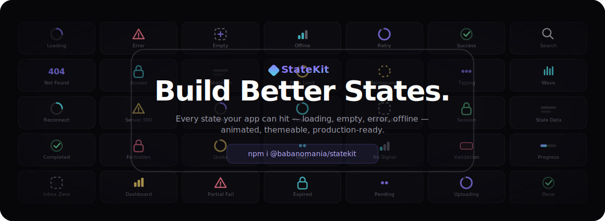

<p align="center">
  
</p>

<p align="center">
  <a href="https://www.npmjs.com/package/@babanomania/statekit"></a>
  <a href="https://github.com/babanomania/state-kit/blob/main/LICENSE"></a>
  <a href="https://babanomania.github.io/state-kit/"></a>
  
</p>

<p align="center">
  <b>Every state your app can hit — loading, empty, error, offline, success, rate-limited —<br/>as animated, themeable, production-ready React components.</b>
</p>

<p align="center">
  <a href="https://babanomania.github.io/state-kit/">Live site</a> ·
  <a href="https://babanomania.github.io/state-kit/components">Components</a> ·
  <a href="https://babanomania.github.io/state-kit/motion">Motion</a> ·
  <a href="https://babanomania.github.io/state-kit/themes">Themes</a>
</p>

---

## Why StateKit

Every app ships loading spinners, empty screens, and error pages — and almost always rebuilds them
from scratch, inconsistently, one component at a time. StateKit gives you **the whole surface area of
application state** as one cohesive, animated, themeable package.

- **50+ states, 32 components** — across Loading, Empty, Error, Success, Connectivity, Security,
  Data, and System. The states most libraries forget (partial table failures, stale data, quota
  exceeded, session expired) are first-class.
- **Themeable in 6 tokens** — `createTheme({ accent, surface, border, radius, blur, elevation })`
  restyles every state at once. Five built-in themes: `minimal`, `aurora`, `neon`, `glass`, and the
  light `enterprise` theme.
- **Motion is the point** — 22 hand-built keyframe animations, every one honoring
  `prefers-reduced-motion`.
- **One boundary, every state** — `DataStateBoundary` wraps a fetch and renders loading, error,
  empty, and offline fallbacks automatically, with built-in retry and offline detection.
- **Drop-in** — ships precompiled CSS, ESM + CJS + types. No Tailwind required in your app.
  `react`/`react-dom` are peer deps; React is never bundled.
- **Accessible by default** — correct `role`/`aria-live` per state category, real focusable action
  buttons, decorative SVG marked `aria-hidden`.

## Quick start

```bash
npm install @babanomania/statekit
```

```tsx
import { StateProvider, DataStateBoundary } from "@babanomania/statekit";
import "@babanomania/statekit/styles.css";

function Users() {
  const { data, loading, error, refetch } = useUsers();

  return (
    <DataStateBoundary loading={loading} error={error} data={data} onRetry={refetch} theme="aurora">
      {(users) => <UsersTable data={users} />}
    </DataStateBoundary>
  );
}

function App() {
  return (
    <StateProvider theme="aurora">
      <Users />
    </StateProvider>
  );
}
```

Theme an entire tree with `StateProvider`, or override per component with a `theme` prop. Build your
own with `createTheme` — the [package README](packages/statekit/README.md) has the full API.

## What's in the box

| Category | Components |
|----------|-----------|
| **Loading** | `Spinner`, `OrbitLoader`, `Skeleton`, `ProgressLoader`, `PulseLoader`, `WaveLoader`, `TypingIndicator` |
| **Empty** | `EmptyState`, `SearchEmptyState`, `FilterEmptyState` |
| **Error** | `ErrorState`, `RetryState`, `ServerErrorState`, `NotFoundState`, `ForbiddenState`, `TimeoutState`, `ValidationErrorState` |
| **Success** | `SuccessState`, `CompletedState` |
| **Connectivity** | `OfflineState`, `ReconnectingState` |
| **Security** | `AccessDeniedState`, `SessionExpiredState` |
| **Data** | `TableState`, `DashboardState`, `WidgetState`, `PartialFailureState`, `PaginationEndState`, `StaleDataState` |
| **System** | `MaintenanceState`, `RateLimitedState`, `QuotaExceededState` |

Plus the composite APIs: `StateProvider`, `createTheme`, `StateBoundary`, and the flagship
`DataStateBoundary`. Browse them all — live, themeable, in light and dark — at the
**[documentation site](https://babanomania.github.io/state-kit/)**.

---

## Build it yourself

This is a pnpm + Turborepo monorepo:

```
packages/statekit/   # the publishable @babanomania/statekit package (library)
apps/web/            # the Next.js site: landing + Components/Motion/Themes docs (GitHub Pages)
design/              # original design prototypes — source of truth for visuals (not shipped)
assets/              # README/marketing assets
```

```bash
pnpm install                              # install all workspace dependencies
pnpm dev                                  # run the site (apps/web) in dev mode
pnpm build                                # build every workspace (library, then site)
pnpm lint                                 # lint all workspaces
pnpm typecheck                            # typecheck all workspaces
pnpm test                                 # run all workspace tests

pnpm --filter ./packages/statekit build   # build just the library (ESM + CJS + .d.ts via tsup)
pnpm --filter ./apps/web build             # build just the site's static export (apps/web/out/)
```

The site is statically exported (`output: 'export'`) and deployed to GitHub Pages under the
`/state-kit` base path. To build the site exactly as it deploys:

```bash
NEXT_PUBLIC_DEPLOY_TARGET=github-pages pnpm --filter ./apps/web build
```

## Releasing the library

This repo uses [Changesets](https://github.com/changesets/changesets) to version and publish
`@babanomania/statekit`.

1. After a PR that changes `packages/statekit`, run `pnpm changeset` and describe the change. Commit
   the generated `.changeset/*.md` file with the PR.
2. Merging to `main` opens a "Version Packages" PR (via `changesets/action`) that bumps the package
   version and updates its changelog.
3. Merging that Version PR publishes `@babanomania/statekit` to npm.

## License

[MIT](LICENSE) © babanomania
